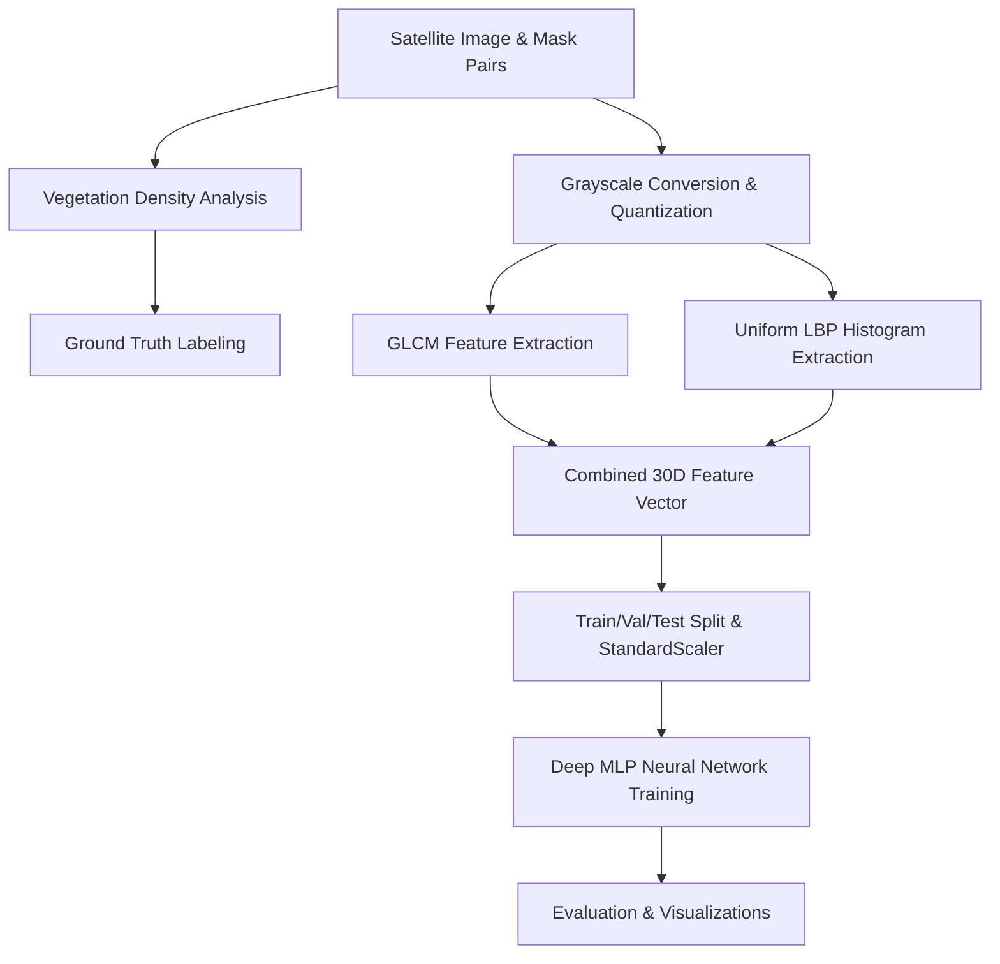

# 🌿 Vegetation Texture Analysis & Classification using Digital Image Processing (DIP)

[](https://www.python.org/)
[](https://www.tensorflow.org/)
[](https://opencv.org/)
[](https://scikit-image.org/)
[](LICENSE)

An end-to-end computer vision and machine learning framework designed for automated vegetation density estimation and texture pattern classification from satellite and aerial imagery. By integrating traditional **Digital Image Processing (DIP)** feature extraction techniques—specifically **Gray-Level Co-occurrence Matrix (GLCM)** and **Local Binary Patterns (LBP)**—with a **Deep Multi-Layer Perceptron (MLP)** Neural Network, this project categorizes terrain into high-density (coarse texture) and low-density (smooth texture) vegetation cover.

---

## 📌 Table of Contents
- [Executive Summary](#-executive-summary)
- [Key Objectives](#-key-objectives)
- [System Architecture & Pipeline](#-system-architecture--pipeline)
- [Methodology & Mathematical Foundations](#-methodology--mathematical-foundations)
  - [1. Vegetation Density & Label Assignment](#1-vegetation-density--label-assignment)
  - [2. Gray-Level Co-occurrence Matrix (GLCM) Features](#2-gray-level-co-occurrence-matrix-glcm-features)
  - [3. Local Binary Patterns (LBP) Texture Descriptors](#3-local-binary-patterns-lbp-texture-descriptors)
  - [4. Deep Neural Network Architecture](#4-deep-neural-network-architecture)
- [Implementation Details](#-implementation-details)
  - [Project Directory Structure](#project-directory-structure)
  - [Hyperparameters & Configuration](#hyperparameters--configuration)
  - [Key Code Components](#key-code-components)
- [Dataset Format & Requirements](#-dataset-format--requirements)
- [Installation & Setup](#-installation--setup)
- [Execution & Usage](#-execution--usage)
- [Evaluation & Visualizations](#-evaluation--visualizations)
- [Future Enhancements](#-future-enhancements)
- [License & Acknowledgments](#-license--acknowledgments)

---

## 📖 Executive Summary

Accurate monitoring of vegetation cover, canopy structure, and land degradation is critical for environmental monitoring, forestry management, and remote sensing analysis. Traditional color-based vegetation indices (e.g., NDVI) can be limited by shadow variations, illumination shifts, or single-band imagery constraints. 

This repository implements a **texture-driven methodology** leveraging texture signatures that characterize spatial variations in surface brightness. Gray-Level Co-occurrence Matrix (GLCM) features capture spatial pixel relationship statistics, while Local Binary Patterns (LBP) encode micro-texture surface structures. These extracted numerical feature vectors are normalized and passed into a deep neural network classifier designed with batch normalization, dropout regularization, and class-weight balancing.

---

## 🎯 Key Objectives

1. **Automated Vegetation Density Quantification**: Compute precise pixel-wise vegetation coverage ratios from satellite mask imagery.
2. **Hybrid DIP + ML Feature Extraction Pipeline**: Extract 30 spatial and statistical textural features combining 2nd-order statistics (GLCM) and local topological patterns (LBP).
3. **Deep Learning Classification**: Train a Deep Multi-Layer Perceptron (MLP) binary classifier to differentiate coarse, high-density canopy structures from smooth, low-density ground cover.
4. **Class Imbalance Mitigation**: Implement automated inverse-frequency class weighting to ensure robust model generalization across imbalanced satellite datasets.
5. **Visual Interpretability & Verification**: Generate automated side-by-side visual overlays of raw satellite images, ground-truth masks, density scores, and model prediction outcomes.

---

## 🏗️ System Architecture & Pipeline

The framework executes through a structured six-stage pipeline:



---

## 🔬 Methodology & Mathematical Foundations

### 1. Vegetation Density & Label Assignment
For a binary vegetation mask \(M\) of dimensions \(H \times W\), the vegetation density index \(D\) is computed as the proportion of non-zero vegetation pixels relative to the total spatial area:

$$D = \frac{\sum_{i=1}^{H} \sum_{j=1}^{W} \mathbb{I}(M(i, j) > 0)}{H \times W}$$

Where \(\mathbb{I}(\cdot)\) is the indicator function. The terrain is categorized based on a threshold \(T_{\text{density}} = 0.3\):

$$\text{Label} = \begin{cases} 1 & \text{if } D > 0.3 \quad \text{(High Vegetation / Coarse Texture)} \\ 0 & \text{if } D \le 0.3 \quad \text{(Low Vegetation / Smooth Texture)} \end{cases}$$

---

### 2. Gray-Level Co-occurrence Matrix (GLCM) Features
Grayscale images are first quantized to 16 intensity levels to optimize computational efficiency while retaining essential gradient transitions. The GLCM matrix \(P(i, j | d, \theta)\) measures how often a pixel with intensity \(i\) occurs horizontally, vertically, or diagonally adjacent to a pixel with intensity \(j\) at displacement distance \(d\) and direction angle \(\theta\).

Extracted distances: \(d \in \{1, 2, 3\}\)  
Extracted angles: \(\theta \in \{0, \frac{\pi}{4}, \frac{\pi}{2}, \frac{3\pi}{4}\}\)

For each normalized co-occurrence matrix \(P\), four primary statistical metrics are extracted and averaged across all spatial displacement configurations:

1. **Contrast** (Local variation measure):
   $$\text{Contrast} = \sum_{i} \sum_{j} (i - j)^2 P(i, j)$$

2. **Energy / Angular Second Moment** (Textural uniformity measure):
   $$\text{Energy} = \sqrt{\sum_{i} \sum_{j} P(i, j)^2}$$

3. **Homogeneity / Inverse Difference Moment** (Closeness of element distribution to GLCM diagonal):
   $$\text{Homogeneity} = \sum_{i} \sum_{j} \frac{P(i, j)}{1 + (i - j)^2}$$

4. **Correlation** (Linear dependency of gray levels of neighbor pixels):
   $$\text{Correlation} = \sum_{i} \sum_{j} \frac{(i - \mu_x)(j - \mu_y) P(i, j)}{\sigma_x \sigma_y}$$

---

### 3. Local Binary Patterns (LBP) Texture Descriptors
Local Binary Patterns capture local micro-textural structural details. Using a circular neighborhood with radius \(R = 3\) and \(P = 24\) sample points (\(P = 8 \times R\)), the LBP code for a central pixel \(g_c\) is defined as:

$$\text{LBP}_{P, R} = \sum_{p=0}^{P-1} s(g_p - g_c) 2^p, \quad \text{where } s(x) = \begin{cases} 1 & \text{if } x \ge 0 \\ 0 & \text{if } x < 0 \end{cases}$$

Using the **`uniform`** LBP variant (patterns with at most 2 bitwise 0-to-1 or 1-to-0 transitions), the resulting normalized histogram produces \(P + 2 = 26\) distinct structural bins representing edges, spots, flat areas, and corners.

#### Final Feature Vector:
Concatenating the 4 GLCM summary statistics with the 26 LBP histogram bin frequencies forms a **30-dimensional feature vector** for each satellite image sample.

---

### 4. Deep Neural Network Architecture

The classification backend employs a Sequential Multi-Layer Perceptron (MLP) built with TensorFlow/Keras:

| Layer Type | Output Dimension | Activation / Options | Regularization |
| :--- | :--- | :--- | :--- |
| **Input Layer** | 30 | — | — |
| **Dense Layer 1** | 128 | ReLU | Batch Normalization, Dropout (0.3) |
| **Dense Layer 2** | 64 | ReLU | Batch Normalization, Dropout (0.3) |
| **Dense Layer 3** | 32 | ReLU | Batch Normalization, Dropout (0.2) |
| **Output Layer** | 1 | Sigmoid | Binary Crossentropy Loss |

#### Optimization Strategy:
- **Optimizer**: Adam ($\text{learning\_rate} = 0.001$)
- **Early Stopping**: Monitored on `val_loss` with patience of 10 epochs, restoring best weights.
- **Class Balancing**: Balanced inverse class weights automatically applied during training.
- **Decision Threshold**: Probability threshold set at $0.4$ for binary decision boundary calibration.

---

## 🛠️ Implementation Details

### Project Directory Structure

```
Vegetation-Texture-Analysis-using-Digital-Image-Processing/
│
├── README.md                           # Main project documentation
├── sample_visualization.png            # Overlay sample visual output
└── dip_forest_project/                 # Primary source code directory
    ├── main.py                         # Complete end-to-end processing & ML training script
    ├── requirements.txt                # Python package dependency manifest
    ├── sample_visualization.png        # Generated dataset sample plot
    ├── prediction_visualization.png    # Neural network prediction plot
    └── dataset/                        # Image data directory
        ├── images/                     # Input satellite/aerial images (.png, .jpg)
        ├── masks/                      # Binary vegetation mask images (.png, .jpg)
        ├── meta_data.csv               # CSV file pairing images with masks
        └── final1/                     # Processed output directory
```

### Hyperparameters & Configuration

Key configuration parameters defined in [`dip_forest_project/main.py`](file:///c:/Users/toppy/OneDrive/Desktop/projects/dip/dip_forest_project/main.py):

```python
DENSITY_THRESHOLD = 0.3    # Threshold to split high vs low vegetation
IMAGE_SIZE        = 256    # Standard image spatial dimensions (256x256)
GLCM_DISTANCES    = [1, 2, 3]
GLCM_ANGLES       = [0, np.pi/4, np.pi/2, 3*np.pi/4]
LBP_RADIUS        = 3      # Radius for LBP operator
LBP_N_POINTS      = 24     # Sample points (8 * LBP_RADIUS)
EPOCHS            = 50     # Max training epochs
BATCH_SIZE        = 32     # Training batch size
TEST_SIZE         = 0.2    # Train/Test split ratio
```

### Key Code Components

- [`load_meta_data()`](file:///c:/Users/toppy/OneDrive/Desktop/projects/dip/dip_forest_project/main.py#L39-L52): Parses metadata file mapping image files to mask files.
- [`compute_vegetation_density()`](file:///c:/Users/toppy/OneDrive/Desktop/projects/dip/dip_forest_project/main.py#L65-L69): Calculates non-zero pixel density ratios from binary vegetation masks.
- [`extract_glcm_features()`](file:///c:/Users/toppy/OneDrive/Desktop/projects/dip/dip_forest_project/main.py#L78-L85): Computes quantized GLCM matrices across 12 distance-direction pairs and extracts contrast, energy, homogeneity, and correlation metrics.
- [`extract_lbp_features()`](file:///c:/Users/toppy/OneDrive/Desktop/projects/dip/dip_forest_project/main.py#L87-L91): Calculates 26-bin uniform Local Binary Pattern histograms.
- [`build_neural_network()`](file:///c:/Users/toppy/OneDrive/Desktop/projects/dip/dip_forest_project/main.py#L127-L130): Builds the 4-layer Keras MLP model with dropout and batch normalization.
- [`train_model()`](file:///c:/Users/toppy/OneDrive/Desktop/projects/dip/dip_forest_project/main.py#L138-L150): Trains the model with balanced class weighting and early stopping callbacks.
- [`visualize_samples()`](file:///c:/Users/toppy/OneDrive/Desktop/projects/dip/dip_forest_project/main.py#L168-L208) & [`visualize_predictions()`](file:///c:/Users/toppy/OneDrive/Desktop/projects/dip/dip_forest_project/main.py#L310-L352): Generates high-resolution visualization grids saved directly to disk.

---

## 📊 Dataset Format & Requirements

The dataset structure requires satellite/aerial RGB images alongside corresponding binary vegetation mask images:

1. **Images Directory** (`dataset/images/`): Contains RGB satellite/aerial scene images (e.g., `image_0000.png`).
2. **Masks Directory** (`dataset/masks/`): Contains binary mask images (e.g., `mask_0000.png`) where white pixels ($255$) represent vegetation cover and black pixels ($0$) represent non-vegetation terrain.
3. **Metadata CSV** (`dataset/meta_data.csv`): CSV file defining explicit filename pairings:
   ```csv
   image_filename,mask_filename
   image_0001.png,mask_0001.png
   image_0002.png,mask_0002.png
   ```

*Note: If custom data is absent, the included script provides a utility function `generate_sample_data()` to generate synthetic benchmarks for testing.*

---

## 💻 Installation & Setup

### Prerequisites
- **Python 3.8+**
- Virtual Environment tool (`venv` or `conda`)

### Step 1: Clone the Repository
```bash
git clone https://github.com/Sowjanya-gedela19/Vegetation-Texture-Analysis-using-Digital-Image-Processing.git
cd Vegetation-Texture-Analysis-using-Digital-Image-Processing
```

### Step 2: Create & Activate Virtual Environment
```bash
# Windows
python -m venv venv
.\venv\Scripts\activate

# Linux / macOS
python3 -m venv venv
source venv/bin/activate
```

### Step 3: Install Required Dependencies
Navigate to the project folder and install dependencies:
```bash
cd dip_forest_project
pip install -r requirements.txt
```

---

## 🚀 Execution & Usage

To run the complete pipeline (data verification, DIP feature extraction, train/val/test dataset splitting, neural network training, evaluation metrics generation, and visualization export):

```bash
python main.py
```

### Output Logs Example:
```text
============================================================
Vegetation Classification from Satellite Images
============================================================
Checking dataset structure...
  Images folder: .../dataset/images
  Masks folder: .../dataset/masks
  CSV file: .../dataset/meta_data.csv
  Found 100 images
  Found 100 masks

Processing images...
  Processed image_0000.png: density=0.582, label=High Vegetation (Coarse)
  Processed image_0001.png: density=0.124, label=Low Vegetation (Smooth)
  ...
Dataset prepared: 100 samples, 30 features
Class distribution: High Vegetation (Coarse)=50, Low Vegetation (Smooth)=50

Training Neural Network...
  Epoch 1/50 - loss: 0.6241 - accuracy: 0.7188 - val_loss: 0.5120 - val_accuracy: 0.8125
  ...
MODEL EVALUATION RESULTS
============================================================
Accuracy: 0.9500 (95.00%)
Prediction threshold: 0.4

Classification Report:
------------------------------------------------------------
                        precision    recall  f1-score   support
 Low Vegetation (Smooth)     0.91      1.00      0.95        10
High Vegetation (Coarse)     1.00      0.90      0.95        10
```

---

## 📈 Evaluation & Visualizations

The pipeline automatically generates two visual artifact plots:

1. **`sample_visualization.png`**: Displays raw satellite images overlaid with colored vegetation mask overlays and calculated density metrics.
2. **`prediction_visualization.png`**: Shows test sample images alongside true ground truth labels vs. neural network predictions.

| Visualization Output | Description |
| :--- | :--- |
| **`sample_visualization.png`** | Ground truth overlay of mask density onto satellite scenes. |
| **`prediction_visualization.png`** | Model classification output comparison grid. |

---

## 🔮 Future Enhancements

- [ ] **Multi-Spectral Imagery Support**: Extend DIP feature extraction to support Near-Infrared (NIR) and Short-Wave Infrared (SWIR) bands for NDVI/EVI integration.
- [ ] **Deep Feature Extractor Integration**: Compare hand-crafted GLCM/LBP features against features extracted via pre-trained CNNs (ResNet, EfficientNet).
- [ ] **Semantic Segmentation (U-Net)**: Transition from whole-image classification to end-to-end pixel-level vegetation texture segmentation.
- [ ] **Interactive Web Dashboard**: Build a Streamlit or Vite/React web UI allowing users to upload satellite images and receive instant density map visualizations.

---

## 📜 License & Acknowledgments

Distributed under the **MIT License**. See `LICENSE` for details.

### Acknowledgments
- **OpenCV & Scikit-Image**: For robust digital image processing implementations.
- **TensorFlow / Keras**: For deep neural network compilation and training.
- **Scikit-Learn**: For dataset partitioning, standardization, and performance evaluation metrics.
