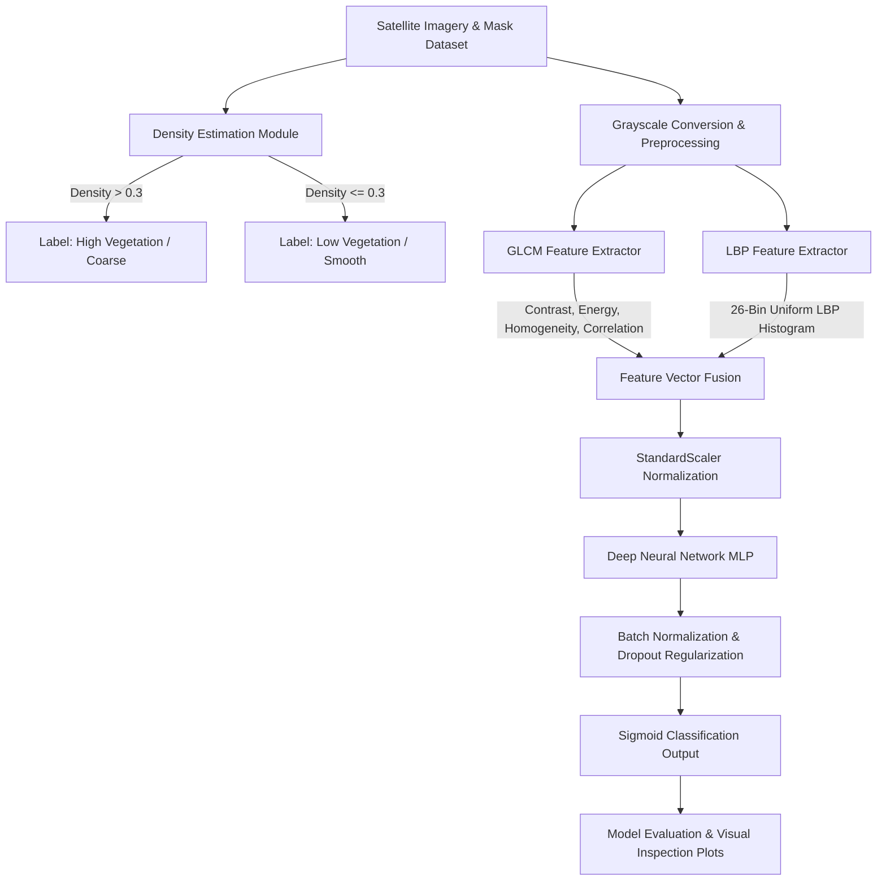

# Vegetation Texture Analysis & Classification using Digital Image Processing (DIP)

[](https://www.python.org/)
[](https://tensorflow.org/)
[](https://opencv.org/)
[](LICENSE)

An advanced end-to-end framework for analyzing vegetation textures and density in satellite imagery. This project integrates classic **Digital Image Processing (DIP)** algorithms—including Gray-Level Co-occurrence Matrix (GLCM) and Local Binary Patterns (LBP)—with modern **Deep Neural Networks (DNN)** to perform automatic feature extraction, density estimation, and vegetation density classification.

---

## 📌 Objectives

1. **Automated Vegetation Density Calculation**: Calculate vegetation cover density from ground-truth binary masks to quantitatively distinguish between dense forest canopy and sparse ground cover.
2. **Hybrid DIP Feature Extraction**: Extract second-order statistical spatial texture features (GLCM) and micro-texture structural descriptors (LBP) to create a robust feature representation invariant to minor lighting variations.
3. **Binary Vegetation Classification**: Classify land covers into **High Vegetation / Coarse Texture** (\(\text{Density} > 0.3\)) and **Low Vegetation / Smooth Texture** (\(\text{Density} \le 0.3\)).
4. **Deep Learning Classification Engine**: Design a regularized Multi-Layer Perceptron (MLP) with Batch Normalization and Dropout layers to accurately classify textures from extracted feature vectors.
5. **Visual Evaluation & Overlay Generation**: Generate side-by-side mask visualizations and prediction overlay maps for geospatial visual analysis.

---

## 🏗 System Architecture

The pipeline follows a modular workflow starting from raw satellite imagery and mask processing to feature engineering and deep learning inference:



---

## 🔬 Methodology & Implementation Details

### 1. Vegetation Density Calculation & Ground Truth Labeling
Vegetation density (\(D\)) is computed by calculating the ratio of positive vegetation pixels in the ground truth mask to total pixel area:

\[
D = \frac{\sum_{i=1}^{H} \sum_{j=1}^{W} M(i, j)}{H \times W}
\]

where \(M(i,j) \in \{0, 255\}\) is the binary mask image of size \(H \times W\).
- **Label Assignment**:
  - **High Vegetation (Coarse)**: Assigned label `1` if \(D > 0.3\).
  - **Low Vegetation (Smooth)**: Assigned label `0` if \(D \le 0.3\).

### 2. Digital Image Processing (DIP) Feature Extraction

#### A. Gray-Level Co-occurrence Matrix (GLCM)
The image is quantized to 16 gray levels to optimize spatial co-occurrence computation. GLCM matrices are generated across multiple pixel offsets \(d \in \{1, 2, 3\}\) and directional angles \(\theta \in \{0^\circ, 45^\circ, 90^\circ, 135^\circ\}\). Four core Haralick features are computed and averaged across directional angles:
- **Contrast**: Measures local intensity variation.
  \[ \text{Contrast} = \sum_{i,j} |i - j|^2 P(i, j) \]
- **Energy (Angular Second Moment)**: Measures textural uniformity.
  \[ \text{Energy} = \sum_{i,j} P(i, j)^2 \]
- **Homogeneity**: Measures closeness of element distribution to GLCM diagonal.
  \[ \text{Homogeneity} = \sum_{i,j} \frac{P(i, j)}{1 + |i - j|} \]
- **Correlation**: Measures linear dependency of gray levels of neighbor pixels.
  \[ \text{Correlation} = \sum_{i,j} \frac{(i - \mu_x)(j - \mu_y) P(i, j)}{\sigma_x \sigma_y} \]

#### B. Local Binary Patterns (LBP)
LBP captures local micro-texture primitives (edges, spots, flat areas). We use **Uniform LBP** with radius \(R = 3\) and \(P = 24\) sampling points (\(P = 8 \times R\)).
- Generates a normalized histogram of \(P + 2 = 26\) uniform patterns as a structural texture descriptor vector.

#### C. Feature Vector Fusion
The resulting 30-dimensional feature vector is formed by concatenating GLCM descriptors and the LBP histogram:
\[ \mathbf{x} = [\text{Contrast}, \text{Energy}, \text{Homogeneity}, \text{Correlation}, h_0, h_1, \dots, h_{25}] \in \mathbb{R}^{30} \]

---

### 3. Neural Network Architecture & Training

The classification network is built using TensorFlow / Keras as a Multi-Layer Perceptron (MLP):

| Layer Type | Units / Output Shape | Activation | Regularization |
| :--- | :--- | :--- | :--- |
| **Input Layer** | 30 features | - | `StandardScaler` Normalization |
| **Dense Layer 1** | 128 | ReLU | Batch Normalization + Dropout (0.3) |
| **Dense Layer 2** | 64 | ReLU | Batch Normalization + Dropout (0.3) |
| **Dense Layer 3** | 32 | ReLU | Batch Normalization + Dropout (0.2) |
| **Output Layer** | 1 | Sigmoid | Binary Cross-Entropy Loss |

- **Optimization**: Adam Optimizer (\(\eta = 0.001\)).
- **Class Balancing**: Balanced class weighting applied via `sklearn.utils.class_weight`.
- **Early Stopping**: Monitored on validation loss (`patience=10`, `restore_best_weights=True`).

---

## 📂 Project Directory Structure

```
.
├── dip_forest_project/
│   ├── dataset/
│   │   ├── images/              # Satellite RGB image files (.png / .jpg)
│   │   ├── masks/               # Binary vegetation mask files (.png / .jpg)
│   │   └── meta_data.csv        # CSV file mapping image_filename to mask_filename
│   ├── main.py                  # End-to-end DIP & ML pipeline script
│   └── requirements.txt         # Project dependencies
├── sample_visualization.png     # Visual plot of sample satellite images & masks
└── README.md                    # Project documentation
```

---

## 🚀 Getting Started

### Prerequisites
- Python **3.8+**
- Recommended virtual environment (`venv` or `conda`)

### Installation

1. **Clone the repository**:
   ```bash
   git clone https://github.com/Sowjanya-gedela19/Vegetation-Texture-Analysis-using-Digital-Image-Processing.git
   cd Vegetation-Texture-Analysis-using-Digital-Image-Processing
   ```

2. **Set up a virtual environment** (optional but recommended):
   ```bash
   python -m venv venv
   # On Windows:
   venv\Scripts\activate
   # On Linux/macOS:
   source venv/bin/activate
   ```

3. **Install dependencies**:
   ```bash
   pip install -r dip_forest_project/requirements.txt
   ```

---

## 💻 Usage

### 1. Running with Custom Dataset
Place your satellite images inside `dip_forest_project/dataset/images/`, corresponding vegetation binary masks in `dip_forest_project/dataset/masks/`, and define their filenames in `dip_forest_project/dataset/meta_data.csv` with columns:
```csv
image_filename,mask_filename
image_0000.png,mask_0000.png
image_0001.png,mask_0001.png
```

Run the complete pipeline:
```bash
python dip_forest_project/main.py
```

### 2. Synthetic Data Generation (Testing/Demo)
To generate synthetic test data for quick validation, call the `generate_sample_data` helper function inside [`main.py`](file:///c:/Users/toppy/OneDrive/Desktop/projects/dip/dip_forest_project/main.py):
```python
from dip_forest_project.main import generate_sample_data
generate_sample_data(num_samples=100, output_path='dip_forest_project/dataset')
```

---

## 📊 Outputs & Visualizations

Upon running `main.py`, the pipeline automatically produces evaluation logs and visual plot outputs:
1. **Sample Visualization (`sample_visualization.png`)**: Displays original satellite images overlaid with ground truth vegetation masks and computed density values.
2. **Prediction Visualization (`prediction_visualization.png`)**: Displays test images alongside true labels vs. Neural Network predictions.
3. **Classification Metrics**: Outputs detailed Accuracy, Precision, Recall, and F1-score classification report in the terminal.

---

## 🛠 Tech Stack

- **Core Language**: Python 3.8+
- **Image Processing**: OpenCV, scikit-image (`skimage.feature.graycomatrix`, `skimage.feature.local_binary_pattern`)
- **Machine Learning & Deep Learning**: TensorFlow / Keras, Scikit-Learn
- **Data & Visualization**: NumPy, Pandas, Matplotlib

---

## 📄 License

Distributed under the MIT License. See `LICENSE` for more information.
